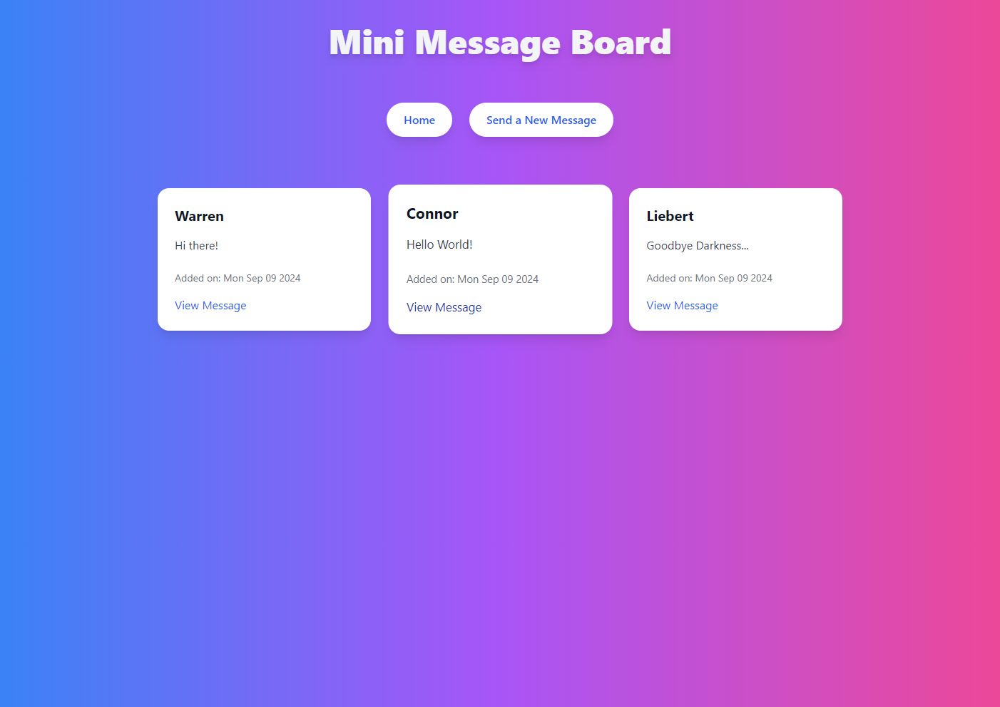

# Mini Message Board

This project uses Express, EJS, Tailwind.



```
npm init -y
npm install express ejs
node --watch app.js

npm install -D tailwindcss
npx tailwindcss init
npx tailwindcss -i ./public/input.css -o ./public/output.css --watch
```
